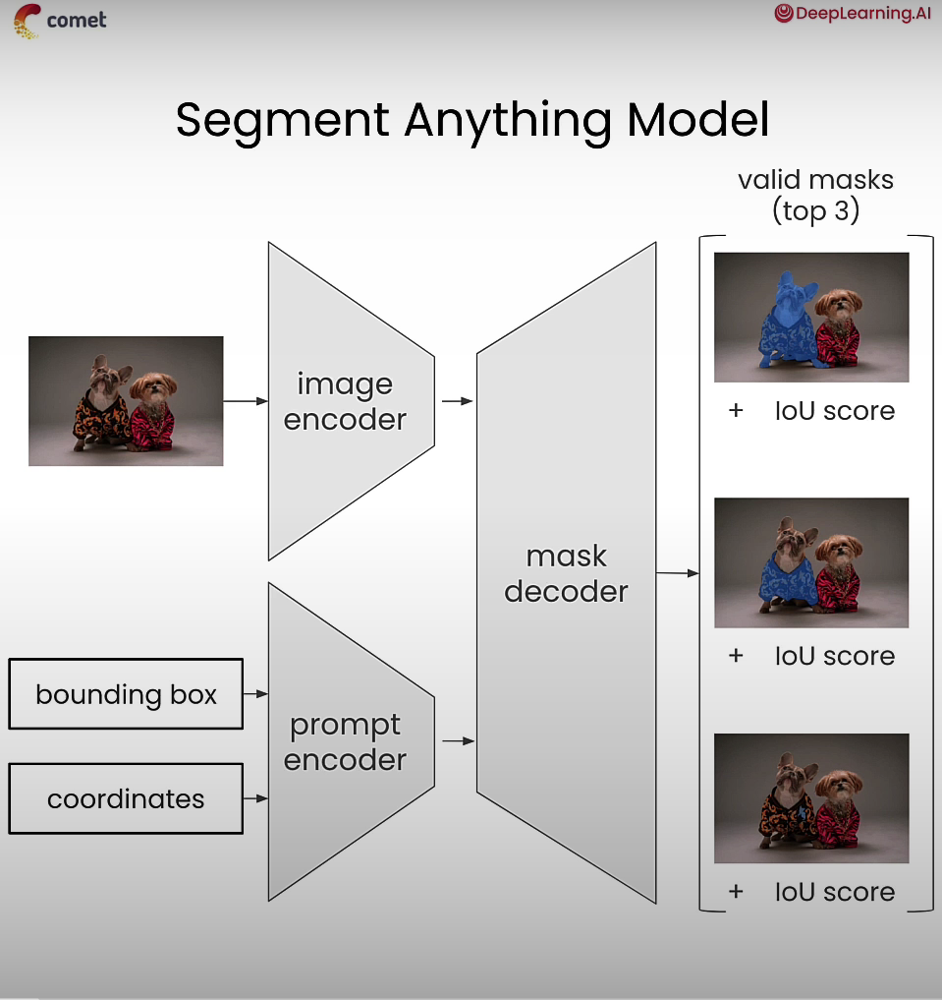
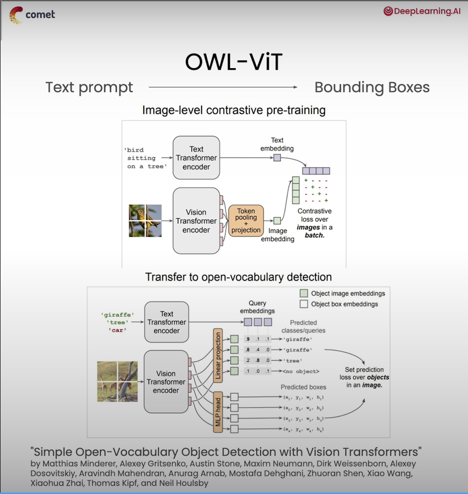
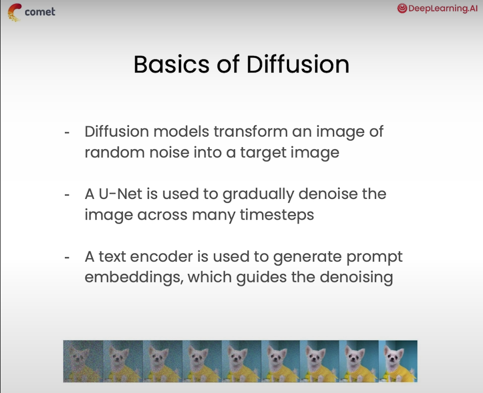
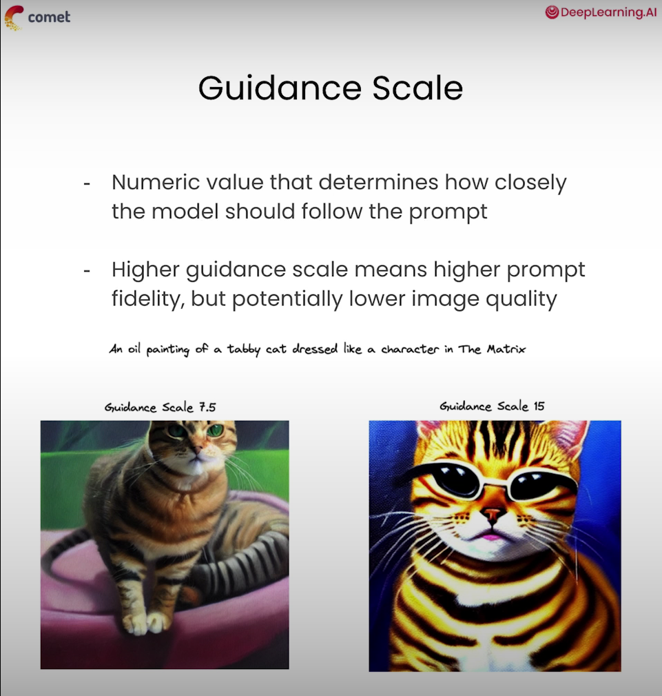
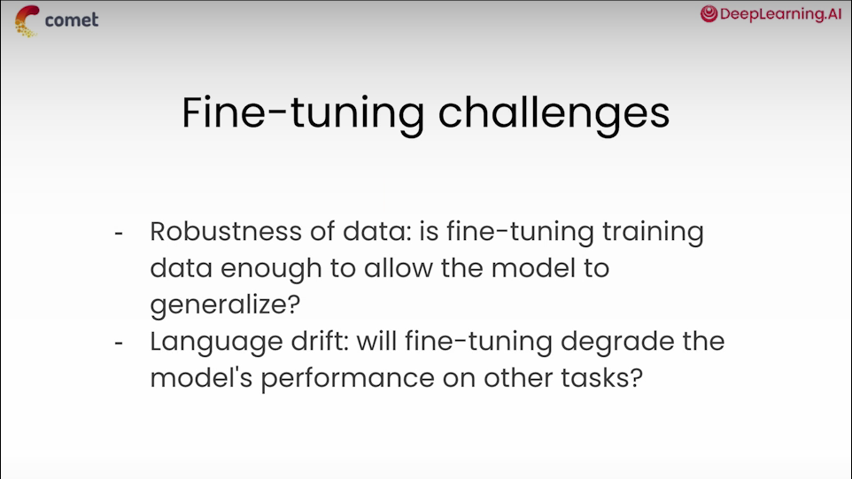
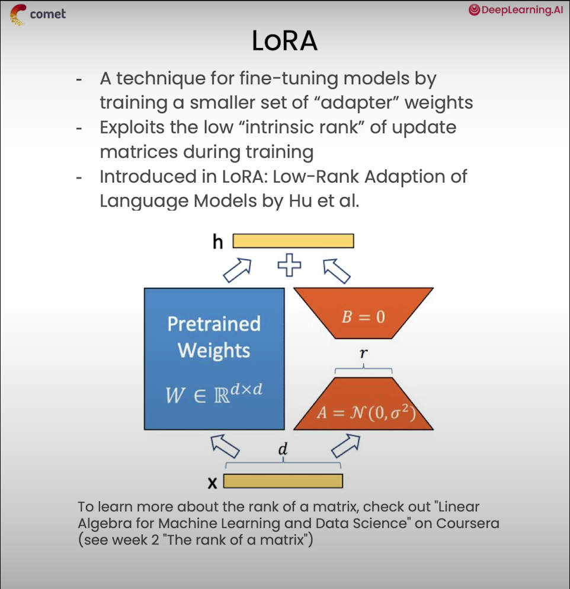
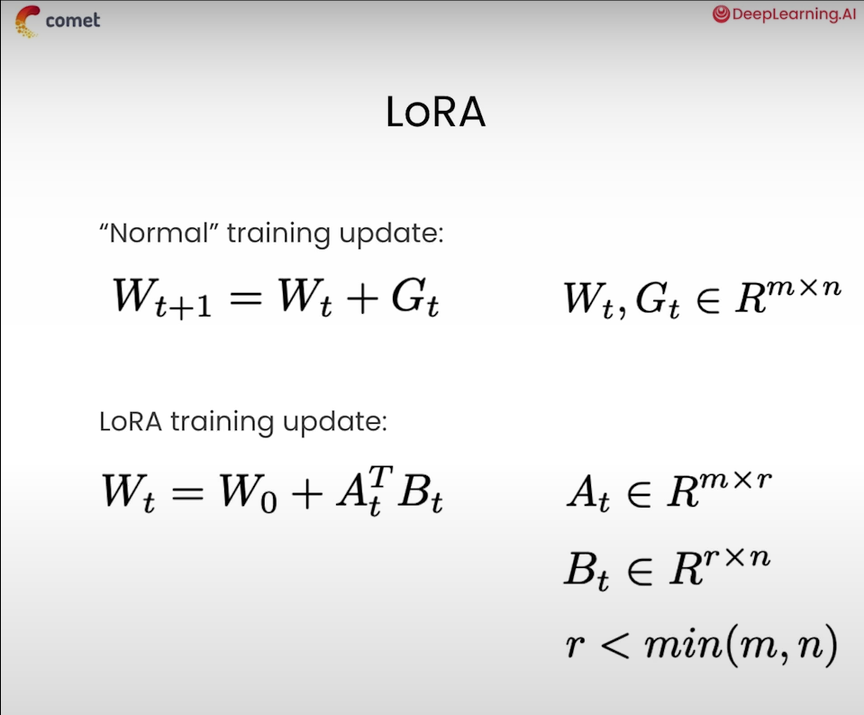

Prompt Engineering for Vision Models
===

Course Link - [Prompt for Vision Models](https://www.deeplearning.ai/short-courses/prompt-engineering-for-vision-models/)

Prompt engineering is used not only in text models but also in vision models. Depending on the vision model, they may use text prompts, but can also work with pixel coordinates, bounding boxes, or segmentation masks.

- Image Generation: Prompt with text and by adjusting hyperparameters like strength, guidance scale, and number of inference steps.
- Image Segmentation: Prompt with positive or negative coordinates, and with bounding box coordinates.
- Object detection: Prompt with natural language to produce a bounding box to isolate specific objects within images.
- In-painting: Combine the above techniques to replace objects within an image with generated content.
- Personalization with Fine-tuning: Generate custom images based on pictures of people or places that you provide, using a fine-tuning technique called DreamBooth.
- Iterating and Experiment Tracking: Prompting and hyperparameter tuning are iterative processes, and therefore experiment tracking can help to identify the most effective combinations. This course will use Comet, a library to track experiments and optimize visual prompt engineering workflows.

Lesson 2: Image Segmentation
---

If you would like to run this code on your own machine, you need to install the following:

    !pip install ultralytics torch

Lesson 3: Object Detection
---

If you would like to run this code on your own machine, you need to install the following:

    !pip install -q comet_ml transformers ultralytics torch  

Lesson 4: Image Generation
---

If you would like to run this code on your own machine, you need to install the following:

    !pip install -q accelerate torch diffusers transformers comet_ml

Lesson 5: Fine-Tuning
---

If you would like to run this code on your own machine, you need to install the following:

    !pip install -q comet_ml accelerate torch diffusers transformers peft bitsandbytes xformers triton

[Back to directory](Training_Course.md)
