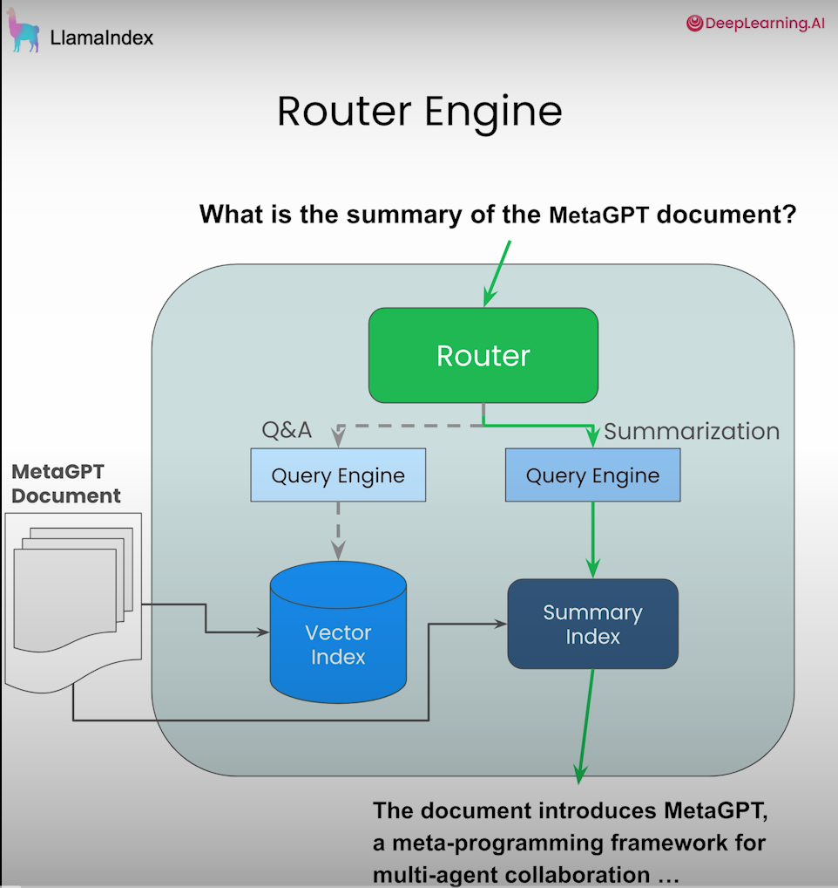
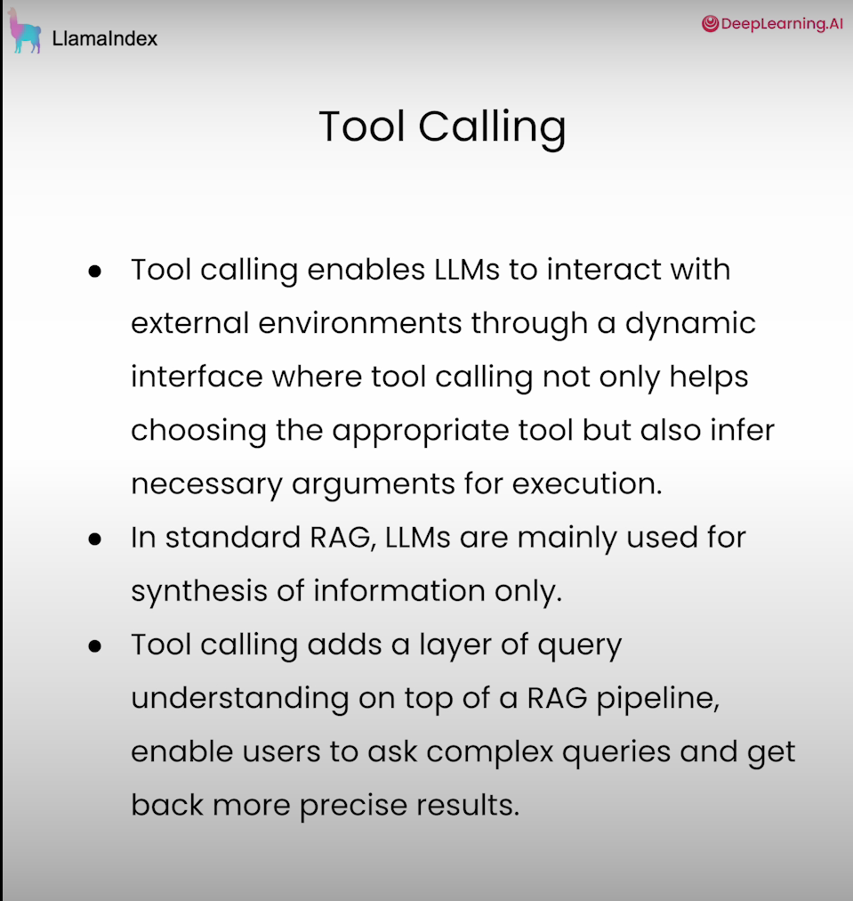
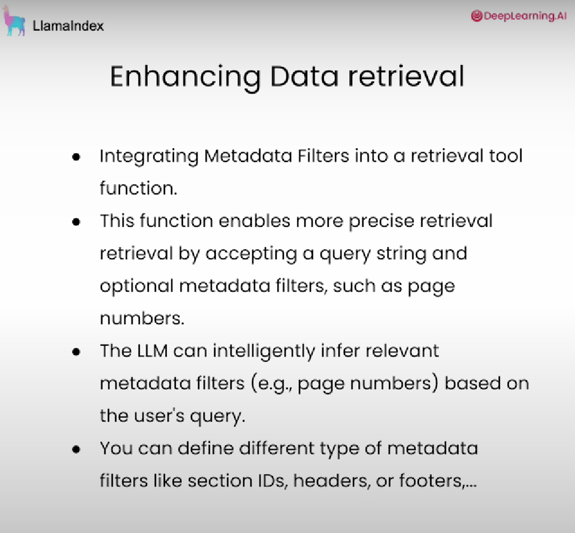
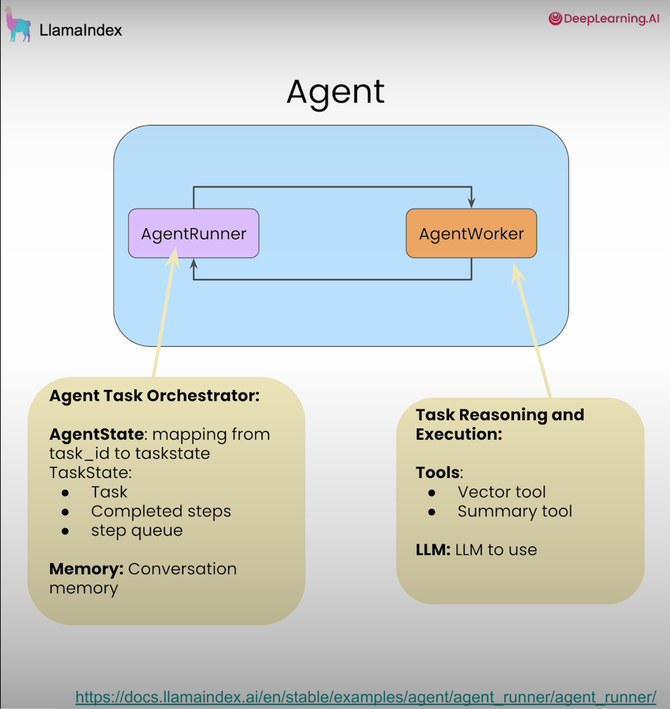
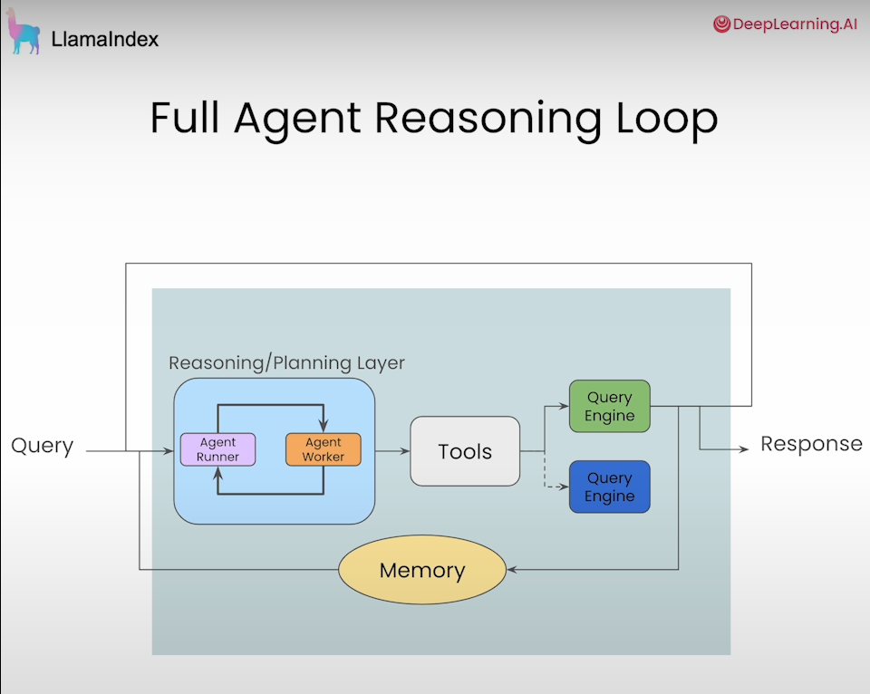
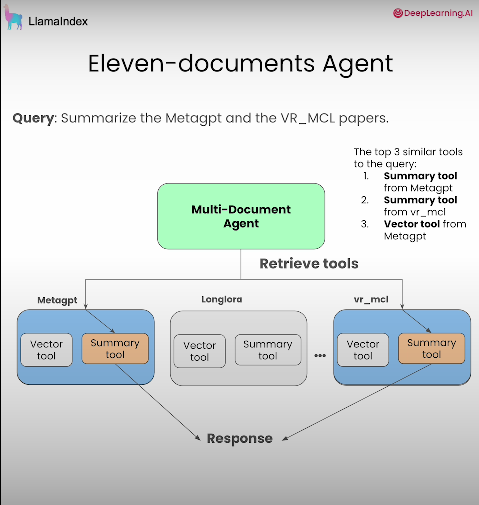

Building Agentic RAG with LlamaIndex
===

Course Link - [Agentic RAG](https://www.deeplearning.ai/short-courses/building-agentic-rag-with-llamaindex/)

To start using agentic RAG, a framework designed to build research agents skilled in tool use, reasoning, and decision-making with your data.

- Build the simplest form of agentic RAG – a router. Given a query, the router will pick one of two query engines, Q&A or summarization, to execute a query over a single document.
- Add tool calling to your router agent where you will use an LLM to not only pick a function to execute but also infer an argument to pass to the function.
- Build a research assistant agent. Instead of tool calling in a single-shot setting, an agent is able to reason over tools in multiple steps.
- Build a multi-document agent where you will learn how to extend the research agent to handle multiple documents.

Lesson 1: Router Engine
---

Lesson 2: Tool Calling
---

Lesson 3: Building an Agent Reasoning Loop
---

Lesson 4: Building a Multi-Document Agent
---

[Back to directory](Training_Course.md)
