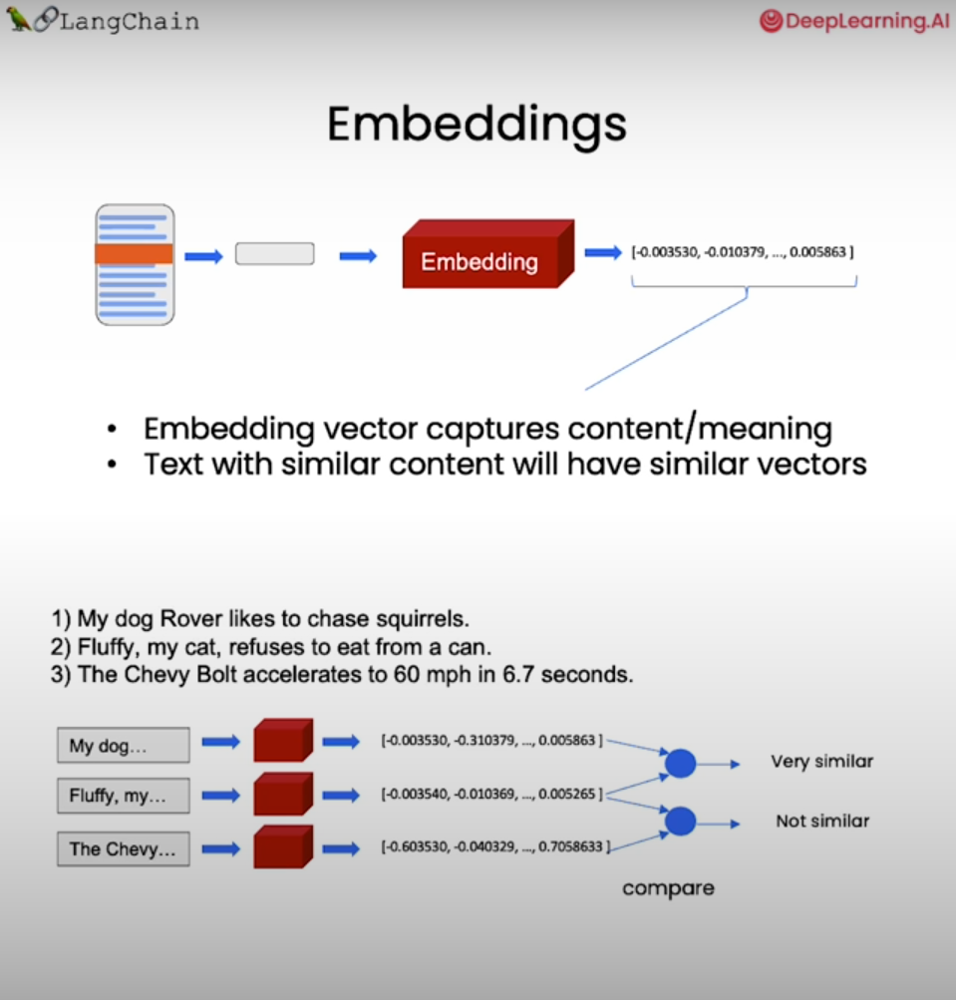
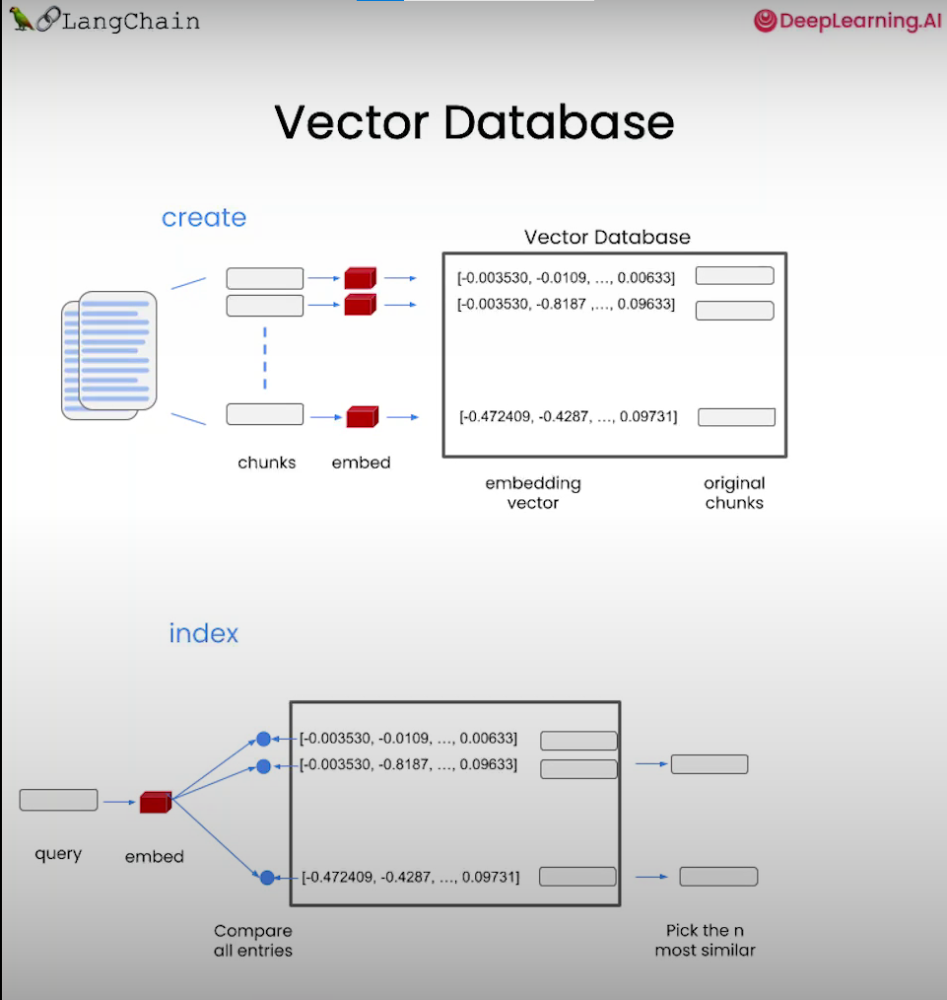
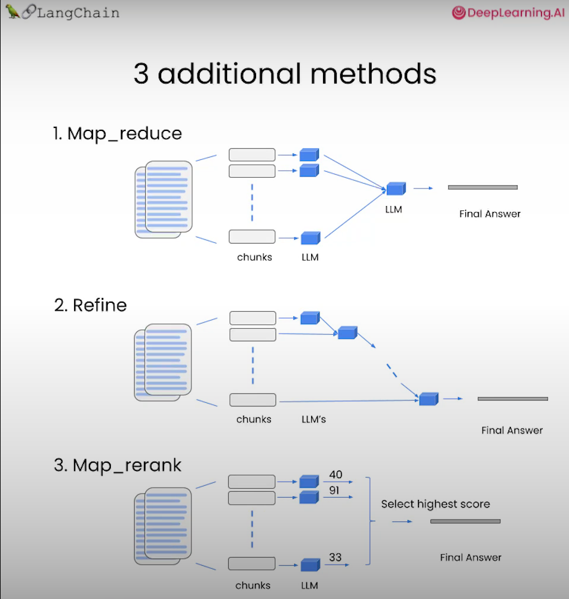

LangChain for LLM Application Development
===

Course Link - [LangChain](https://www.deeplearning.ai/short-courses/langchain-for-llm-application-development/)

topics:

- Models, Prompts and Parsers: calling LLMs, providing prompts and parsing the response
- Memories for LLMs: memories to store conversations and manage limited context space
- Chains: creating sequences of operations
- Question Answering over Documents: apply LLMs to your proprietary data and use case requirements
- Agents: explore the powerful emerging development of LLM as reasoning agents.

LangChain: Models, Prompts and Output Parsers
---

- Direct API calls to OpenAI
- API calls through - LangChain: Prompts, odels, Output parsers

LangChain: Memory
---

- ConversationBufferMemory
- ConversationBufferWindowMemory
- ConversationTokenBufferMemory
- ConversationSummaryMemory

Chains in LangChain
---

- LLMChain
- Sequential Chains
  - SimpleSequentialChain
  - SequentialChain
- Router Chain

LangChain: Q&A over Documents
---

LangChain: Evaluation
---

- Example generation
- Manual evaluation (and debuging)
- LLM-assisted evaluation
- LangChain evaluation platform

LangChain: Agents
---

- Using built in LangChain tools: DuckDuckGo search and Wikipedia
- Defining your own tools

[Back to directory](Training_Course.md)
