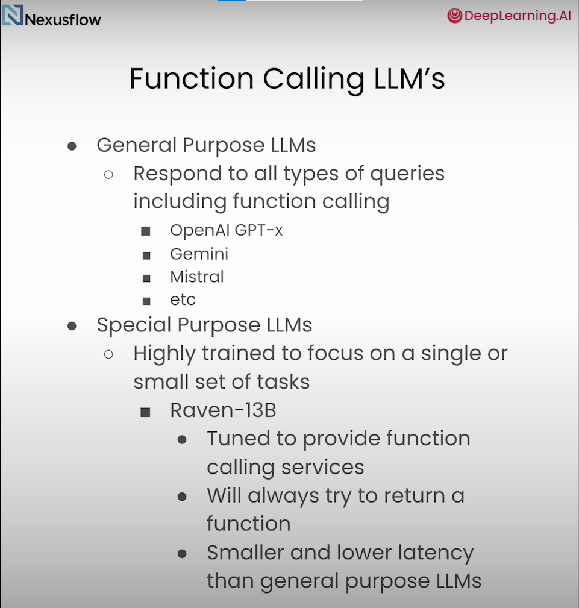

LLM2: Function-Calling and Data Extraction with LLMs
===

Course Link - [Function-Calling and Data Extraction with LLMs](https://www.coursera.org/projects/function-calling-and-data-extraction-with-llms)

Function-calling allows you to extend LLMs with custom capabilities by enabling them to form calls to external functions based on natural language instructions. Structured data extraction enables LLMs to pull usable information from unstructured text.

You’ll work with NexusRavenV2-13B, an open source model fine-tuned for function-calling and data extraction. The model, available on Hugging Face, has outperformed GPT-4 in some function-calling tasks, and has 13 billion parameters so it can be hosted locally.

- Learn how you can use function-calling in detail: form prompts with function definitions, and use an LLM response to call those functions.
- Use an LLM with multiple function calls, including parallel and nested function calls. This allows you to create complex agent workflows where an LLM plans and executes a series of function calls to achieve a goal.
- Use OpenAPI specifications to build function calls that can access web services.
- Use function-calling to extract structured data from a natural language input.
- Build an application that takes customer service transcripts, builds SQL calls, and stores results in a database with commands generated by the LLM.

Introduction To Function Calling
---

    def give_joke(category : str):
        """
        Joke categories. Supports: Any, Misc, Programming, Pun, Spooky, Christmas.
        """

        url = f"https://v2.jokeapi.dev/joke/{category}?safe-mode&type=twopart"
        response = requests.get(url)
        print(response.json()["setup"])
        print(response.json()["delivery"])
    
    USER_QUERY = "Hey! Can you get me a joke for this december?"
    
    raven_functions = \
    f'''
    def give_joke(category : str):
        """
        Joke categories. Supports: Any, Misc, Programming, Dark, Pun, Spooky, Christmas.
        """

    User Query: {USER_QUERY}<human_end>
    '''
    call = query_raven(raven_functions)

[Back to directory](Training_Course.md)
