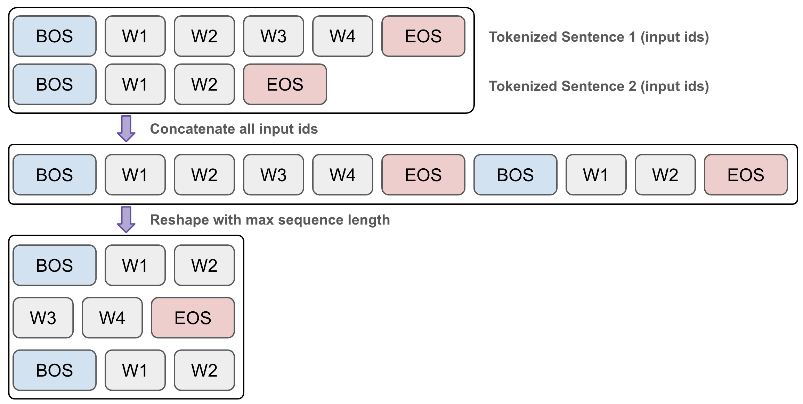
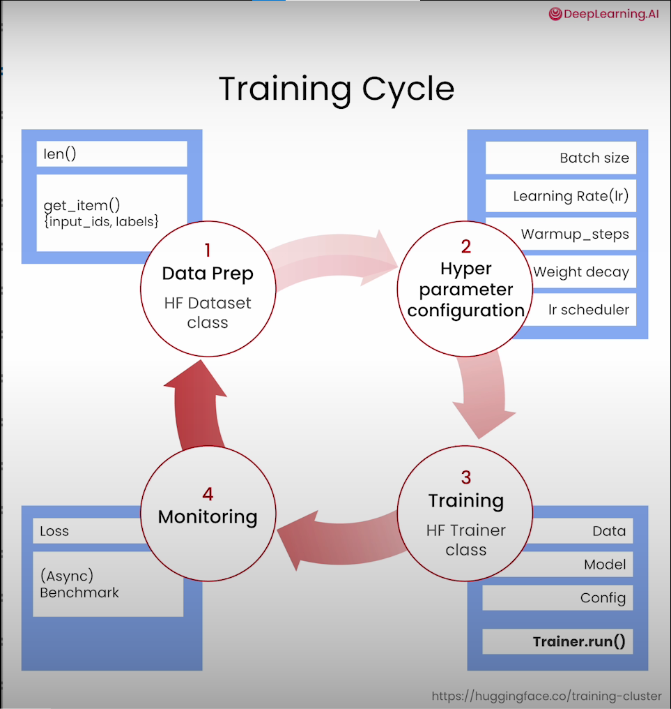
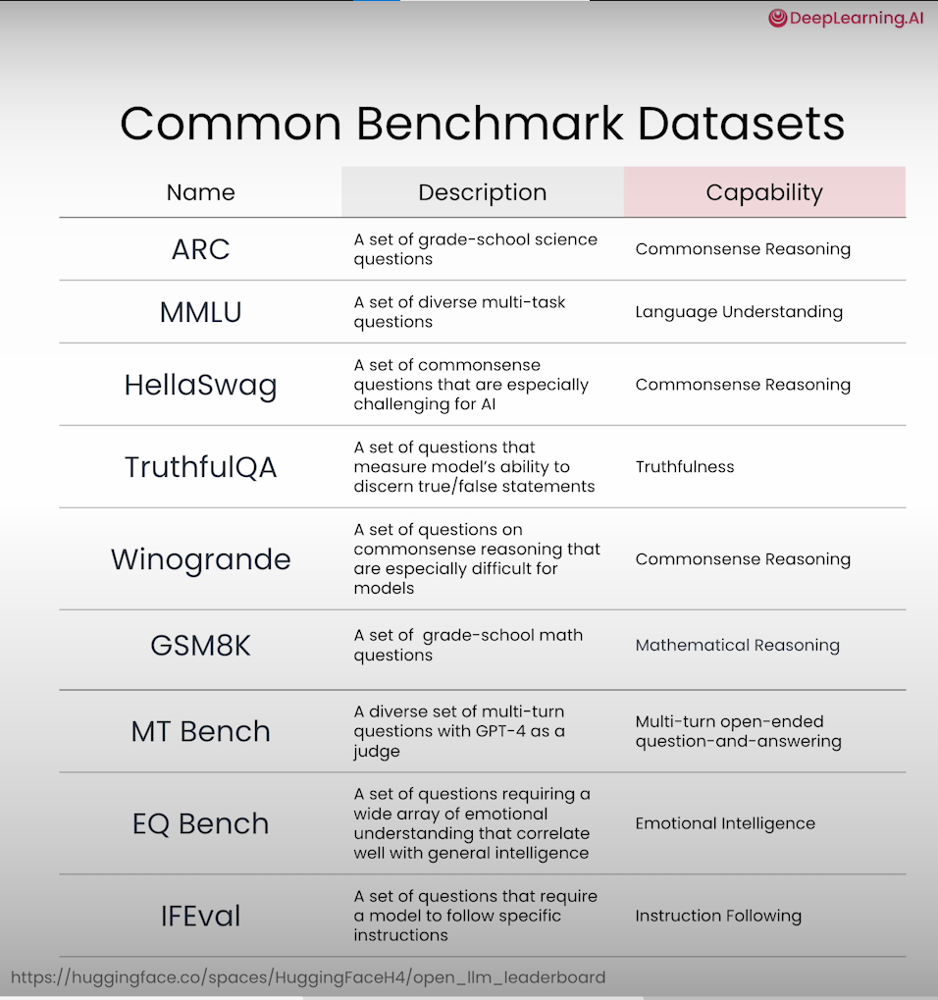

Pretraining LLMs
===

Course Link - [Pretraining LLMs](https://www.deeplearning.ai/short-courses/pretraining-llms/)

Pretraining involves teaching an LLM to predict the next token using vast text datasets, resulting in a base model, and this base model requires further fine-tuning for optimal performance and safety. In this course, you’ll learn to pretrain a model from scratch and also to take a model that’s already been pretrained and continue the pretraining process on your own data.

- Explore scenarios where pretraining is the optimal choice for model performance. Compare text generation across different versions of the same model to understand the performance differences between base, fine-tuned, and specialized pre-trained models.
- Learn how to create a high-quality training dataset using web text and existing datasets, which is crucial for effective model pretraining.
- Prepare your cleaned dataset for training. Learn how to package your training data for use with the Hugging Face library.
- Explore ways to configure and initialize a model for training and see how these choices impact the speed of pretraining.
- Learn how to configure and execute a training run, enabling you to train your own model.
- Learn how to assess your trained model’s performance and explore common evaluation strategies for LLMs, including important benchmark tasks used to compare different models’ performance.

Notes
---

Lesson 1: Why Pretraining?
---

Lecture 2: Data Preparation
---

Data cleaning

- Filter out samples that are too short
- Remove repetitions within a single text example
- Remove duplicated documents
- Quality filter to remove non-English texts

Lesson 3: Data Packaging
---

Lesson 4: Preparing your model for training
---

Weight initialization

In the next sections, you'll explore four different ways to initialize the weights of a model for training:

- Random weight initialization
- Using an existing model for continued pre-training
- Downscaling an existing model
- Upscaling an existing model
        Here you are going to upscale the tinySolar-248m-4k model from 12 layers to 16 layers. Here are the steps you'll take:

        Configure a 16 layer model and initialize it with random weights
        Load the 12 layer tinySolar-248m-4k model into memory
        Copy the bottom 8 and top 8 layers from the 12 layer model and use them to overwrite the random weights of the 16 layer model
        Copy over the embedding and classifying layers to replace the randomly initialized counterparts in the 16 layer model

Lesson 5. Model training
---

Lesson 6. Model evaluation
---

[Back to directory](Training_Course.md)
